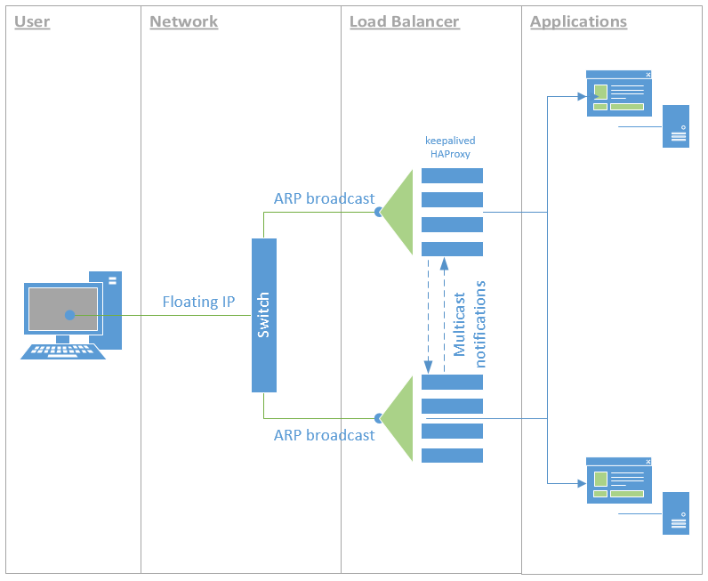

# High-availability load balancer with Rancher

This example demonstrate one way of setting up a high-availability web service
using *Docker*, *Rancher* and *Keepalived*. The following diagram is a 
representation of what we are going to achieve:



## Server/hosts infrastructure
In this example, we are using 4 servers. In the concrete example this is based
on, two are virtual (for running the load balancer containers) and two are 
physical (to run multiple web applications which are CPU and RAM intensive). 
While this is the concrete set up, you can have 4 virtual machines, or 4 
physical machines. It could possibly even run well with only 2 machines (virtual
or physical).

For the purpose of scheduling container execution through Rancher, each server
is configured with a `role` label. The two virtual machine have the `role` 
label set to `load-balancer` and the two physical are set to `apps`.

## Web application service
The web application service is your business payload - whatever it is. In my 
concret example, it is a Java based web application. The service is configured
in Rancher, setting the appropriate environment variables for the application,
etc.

The key point on this service is the scheduling. In the Rancher's scheduling
tab, we select *the host `must` have a `host label` of `role` = `app`*. We also
tell Rancher to run 2 containers - however this could be *one container per host*
as well. 

In my example, I could have more servers set up to run the applications and I 
don't want more than 2 container instances per service, regardless of how many 
servers I add to the pool. I run multiple services and each service will start 
2 containers on any which 2 hosts that have the `role = app` label. To that 
effect, I also set a scheduling rule that states: *The host `should not` have a
`service with the name` `(fill in the blank)`*. That way, I can distribute the
load around.

## Load balancer service
Next comes the load balancer service. This is done using the standard Rancher
load balancer service. An instance is configured, mapping the requests to the
web application service.

The key point here is again the scheduling. Here we select *the host `must` have 
a `host label` of `role` = `load-balancer`* so that Rancher starts the containers
for the load balancer on the right servers. I also tell Rancher to start a 
container instance on every hosts (which match the scheduling rule).

With this done, Rancher starts two load balancer containers - one on each host.
This is great because now we have two load balancers, but they are both different
IP addresses.

We could do a DNS round-robin, that would be ok but wouldn't give us a real 
failsafe scenario or even a zero-downtime upgrade. That's why we use *Keepalived*.

## Keepalived
What we want to do now is make it that one of the two servers on which we run
the load balancer, share a single *public* IP address. *Keepalived* makes it 
easy to set that up. Now we could run the daemon locally on each machine but 
let's do this as a Docker container.

In Rancher, we create a *Keepalived* service, using the same scheduling rules
as the load balancer. It would be great to be able to put a sidekick container
attached to the load balancer service but that's not available. 

So to repeat, our scheduling rules are *the host `must` have 
a `host label` of `role` = `load-balancer`* and we tell rancher to start a 
container instance on every hosts (which match the scheduling rule).

For *Keepalived* to work however, we must also set the *Networking* to *Host*
instead of *Managed* and add the `NET_ADMIN` and `NET_BROADCAST` *Capabilities* 
under *Security/Host*.

### Keepalived container image
You can use the `Dockerfile` provided in this project for this or build your
own based on it.

In my example, I used a static configuration file which is stored in a Git 
repository and is downloaded when the container first starts. This is very 
peculiar to my infrastructure so won't be detailed here, however, here is the 
configuration file that is used:

```
global_defs {
    router_id {{ROUTER_ID}}
    vrrp_version 2
    vrrp_garp_master_delay 1
    vrrp_garp_master_refresh
    notification_email {
       joe@example.com
    }
    notification_email_from keepalived@example.com
    smtp_server smtp.example.com
    smtp_connect_timeout 30
}  

vrrp_script chk_haproxy {
    script       "ss -ltn | grep 80"
    timeout 3    # timeout script if it takes more than 3s
    interval 2   # check every 2 seconds
    fall 2       # require 2 failures for KO
    rise 2       # require 2 successes for OK
}   

vrrp_instance apps-vips {
    state BACKUP
    interface eth0
    virtual_router_id 1
    priority 100
    advert_int 1
    nopreempt
    dont_track_primary
    track_script {
        chk_haproxy
    }
    authentication {
        auth_type PASS
        auth_pass incommsys-vips
    }
    virtual_ipaddress {
        10.10.10.2/24 dev eth0
    }
    smtp_alert
}
```

``{{ROUTER_ID}}`` is replaced at the container start-up with the container
hostname:

```
ROUTER_ID=$(hostname)
echo "Setting Router ID to: $ROUTER_ID"
sed -i "s/{{ROUTER_ID}}/${ROUTER_ID}/" /etc/keepalived/keepalived.conf
```

Once the containers are started, they will contact each other, establish a 
*MASTER* and you will be able to access the application, through the load 
balancer, by browsing to the virtual IP address (`10.10.10.2` in the example
configuration above).

## References

 - [Rancher + Keepalived](https://forums.rancher.com/t/rancher-keepalived/1508/23)
 - [VRRP On Linux Using Keepalived - The Basics](https://packetpushers.net/vrrp-linux-using-keepalived-2/)
 - [Fix for: Keepalived router enters fault state on link down](http://s.co.tt/2014/06/06/fix-for-keepalived-router-enters-fault-state-on-link-down/)
 - [Hihh-availability with HAProxy and keepalived on Ubuntu 12.04](https://deviantony.wordpress.com/2014/07/18/load-balancing-and-high-availability-with-haproxy-and-keepalived/)
 - [keepalived.conf.SYNOPSIS](https://github.com/acassen/keepalived/blob/master/doc/keepalived.conf.SYNOPSIS)
 - [Virtual Router Redundancy Protocol](https://en.wikipedia.org/wiki/Virtual_Router_Redundancy_Protocol)